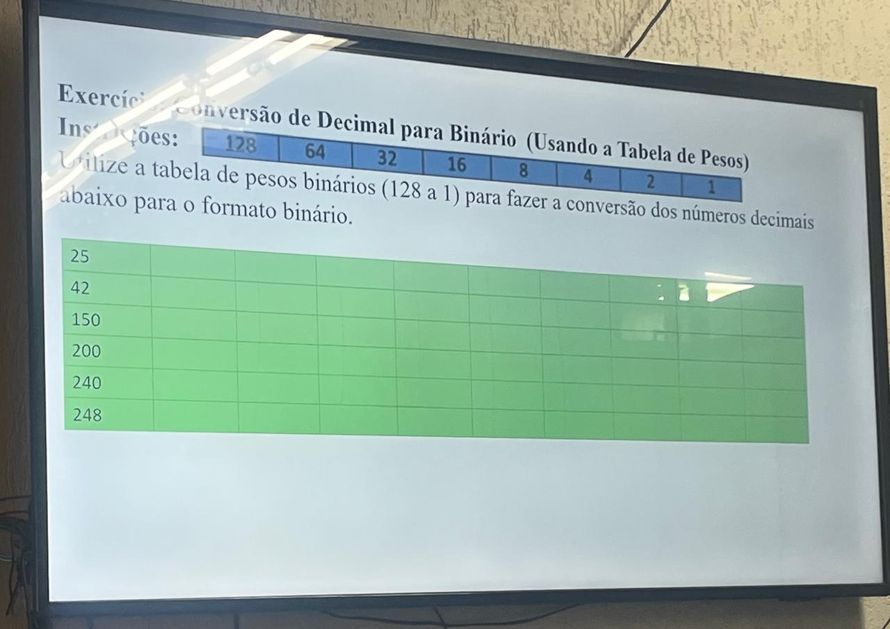

Serviço Nacional de Aprendizagem Comercial  
Brasília, 30 de setembro de 2025  
Anderson de Matos Guimarães  
Professor: Moisés Mendes de Andrade

# ATIVIDADE DE CONVERSÃO DE DECIMAL PARA BINÁRIO

| Decimal | 128 | 64 | 32 | 16 | 8 | 4 | 2 | 1 | Binário |
|--------|-----|----|----|----|---|---|---|---|---|
| 25     |  0  |  0 |  0 | **1** | **1** | 0 | 0 | **1** | 00011001 |
| 42     |  0  |  0 | **1** |  0 | **1** | 0 | **1** | 0 | 00101010 |
| 150    | **1** |  0 |  0 | **1** | 0 | **1** | **1** | 0 | 10010110 |
| 200    | **1** | **1** |  0 |  0 | **1** | 0 | 0 | 0 | 11001000 |
| 240    | **1** | **1** | **1** | **1** | 0 | 0 | 0 | 0 | 11110000
| 248    | **1** | **1** | **1** | **1** | **1** | 0 | 0 | 0 | 11111000 |

---

| Endereço | Máscara | Rede | Faixa dos Hosts | Broadcast |
|--- | ---| --- | --- | --- |
| 10.10.100.1| 255.0.0.0/8| 10.0.0.0 | 10.0.0.1 -> 10.255.255.254 | 10.255.255.255 |
| 172.16.10.5 | 255.255.0.0/16 | 172.16.0.0 | 172.16.0.1 -> 172.16.255.254 | 172.16.255.255 |
|192.168.5.1 | 255.255.255.0/24 | 192.168.5.0 | 192.168.5.1 -> 192.168.5.254 | 192.168.5.255 |
